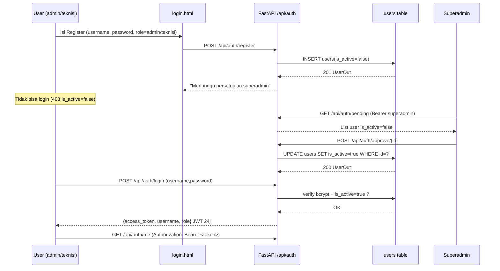

# REVO — Dokumentasi Database Login

> **B_gadget POS Service HP** | Database Auth System untuk **Revo**
> Role: `superadmin`, `admin`, `teknisi`
> Stack: **FastAPI + SQLite + SQLAlchemy + JWT (HS256) + bcrypt**
> Update: 6 September 2026

---

## Daftar Isi
1. [Tujuan](#1-tujuan)
2. [Ringkasan Role](#2-ringkasan-role)
3. [Skema Database](#3-skema-database)
4. [ERD & Relasi](#4-erd--relasi)
5. [RBAC — Matrix Hak Akses](#5-rbac--matrix-hak-akses)
6. [Alur Auth](#6-alur-auth)
7. [API Endpoint](#7-api-endpoint)
8. [DDL SQL & Model](#8-ddl-sql--model)
9. [Seed & Default Superadmin](#9-seed--default-superadmin)
10. [Keamanan](#10-keamanan)
11. [Integrasi Frontend](#11-integrasi-frontend)
12. [Cara Migrasi: dari `kasir` ke 3 Role Revo](#12-cara-migrasi-dari-kasir-ke-3-role-revo)
13. [Testing (curl)](#13-testing-curl)
14. [Next Improvement](#14-next-improvement)

---

## 1. Tujuan

Revo adalah modul **database login** untuk B_gadget yang memisahkan 3 level aktor:

- **superadmin** — pemilik / owner, kontrol penuh: setujui akun, kelola semua user, lihat semua data.
- **admin** — operasional harian: kelola pelanggan, service, laporan, inventory, transaksi.
- **teknisi** — eksekutor service: update status service, garansi, failed, proses.

Semua autentikasi disimpan di tabel `users` dengan `is_active` sebagai gate persetujuan, password hash bcrypt, dan JWT Bearer 24 jam.

File terkait:
- `backend/app/models.py:67` — model `User`
- `backend/app/auth.py:1` — hash, verify, JWT, `ensure_superadmin()`
- `backend/app/routers/auth.py:1` — semua endpoint `/api/auth/*`
- `backend/app/database.py:1` — engine SQLite `b_gadget.db`
- `frontend/login.html:1` — form Login + Register
- `frontend/index.html:90` — menu `approval-akun` (khusus superadmin)

---

## 2. Ringkasan Role

| Role | Dibuat Via | `is_active` Awal | Bisa Login Langsung? | Deskripsi |
|------|------------|------------------|----------------------|-----------|
| `superadmin` | Auto-seed saat startup (`auth.py:50`) atau `POST /api/auth/seed-superadmin` | `true` | Ya | 1 akun default: `superadmin / bismillah`. Tidak bisa diregistrasi via `/register`. Tidak bisa dihapus/bekukan. |
| `admin` | `POST /api/auth/register` | `false` | **Tidak** — tunggu approve superadmin | Kelola operasional toko: service, pelanggan, transaksi, laporan. |
| `teknisi` | `POST /api/auth/register` | `false` | **Tidak** — tunggu approve superadmin | Fokus ke proses service: Antri → Dikerjakan → Selesai / Failed / Garansi. |

> **Catatan existing:** di kode lama ada role `kasir` (`routers/auth.py:157`). Untuk **Revo murni 3 role**, `kasir` diperlakukan sebagai alias `admin` atau dimigrasikan. Lihat §12.

---

## 3. Skema Database

### 3.1 Tabel `users` (inti login Revo)

| Kolom | Tipe | Constraint | Default | Ket |
|-------|------|------------|---------|-----|
| `id` | `INTEGER` | `PK`, `AUTOINCREMENT`, `INDEX` | — | ID unik |
| `username` | `VARCHAR(50)` | `UNIQUE`, `NOT NULL`, `INDEX` | — | 3–50 char, lowercase `superadmin` reserved |
| `password_hash` | `VARCHAR(255)` | `NOT NULL` | — | bcrypt hash (passlib), never store plain |
| `role` | `VARCHAR(20)` | `CHECK IN ('superadmin','admin','teknisi')` | `'superadmin'` untuk seed | Role Revo |
| `is_active` | `BOOLEAN` | `NOT NULL` | `TRUE` (superadmin) / `FALSE` (register) | Gate persetujuan superadmin |
| `created_at` | `DATETIME` | `DEFAULT CURRENT_TIMESTAMP` | `func.now()` | Kapan akun dibuat |
| `last_login` | `DATETIME` | `NULLABLE` | `NULL` | Update tiap login sukses |

**SQLAlchemy Model:** `backend/app/models.py:67`

```python
class User(Base):
    __tablename__ = "users"
    id = Column(Integer, primary_key=True, index=True)
    username = Column(String(50), unique=True, nullable=False, index=True)
    password_hash = Column(String(255), nullable=False)
    role = Column(String(20), default="superadmin")  # superadmin, admin, teknisi
    is_active = Column(Boolean, default=True)
    created_at = Column(DateTime, default=func.now())
    last_login = Column(DateTime, nullable=True)
```

### 3.2 Tabel Terkait (konteks Revo)

| Tabel | PK | FK | Ket |
|-------|----|----|-----|
| `technicians` | `id` | — | Legacy teknisi (Andi, Sinta, Budi). Tetap ada untuk kompatibilitas `Service.teknisi`. Revo: bisa sinkron ke `users` role `teknisi` via `GET /api/auth/available-technicians` |
| `services` | `invoice` (`VARCHAR(20)`) | `customer_id`, `technician_id` | Transaksi service. Field `teknisi` (denormalized) dan `penerima` diisi dari `users.username` aktif |
| `customers` | `id` | — | Data pelanggan (`nama`, `wa` unique) |

---

## 4. ERD & Relasi

```
┌──────────────┐         ┌──────────────┐         ┌──────────────┐
│    users     │         │   services   │         │  customers   │
├──────────────┤         ├──────────────┤         ├──────────────┤
│ PK id        │         │ PK invoice   │◄────────│ PK id        │
│    username  │         │ FK customer_id│────────►│    nama      │
│    role      ├────┐    │ FK technician_id│      │    wa (UQ)   │
│    is_active │    │    │    nama      │         └──────────────┘
│    password_hash   │    │    wa        │                ▲
│    created_at│    └────►    teknisi*   │                │
│    last_login│         │    penerima* │                │
└──────────────┘         │    status    │         ┌──────────────┐
       │                 │    biaya     │         │ technicians  │
       │                 │    deadline  │         ├──────────────┤
       │                 └──────────────┘         │ PK id        │
       │                        ▲                 │    nama (UQ) │
       └────────────────────────┘                 │    foto      │
         available-technicians:                   │    is_active │
         users (role=teknisi/admin/superadmin)    └──────────────┘
         UNION technicians (legacy)
```

`* teknisi & penerima = username dari users aktif (denormalized untuk cepat, FK opsional ke technicians.id)`

---

## 5. RBAC — Matrix Hak Akses

| Fitur / Endpoint | superadmin | admin | teknisi | Tanpa Login |
|------------------|:----------:|:-----:|:-------:|:-----------:|
| **Login** `POST /api/auth/login` | ✅ | ✅* | ✅* | ✅ |
| **Register** `POST /api/auth/register` | ✅ | ✅ | ✅ | ✅ |
| **Lihat profil sendiri** `GET /api/auth/me` | ✅ | ✅ | ✅ | ❌ 401 |
| **List semua user** `GET /api/auth/users` | ✅ | ❌ 403 | ❌ 403 | ❌ |
| **Pending approval** `GET /api/auth/pending` | ✅ | ❌ | ❌ | ❌ |
| **Approve** `POST /api/auth/approve/{id}` | ✅ | ❌ | ❌ | ❌ |
| **Reject/Hapus pending** `POST /api/auth/reject/{id}` | ✅ | ❌ | ❌ | ❌ |
| **Edit user** `PUT /api/auth/users/{id}` | ✅ | ❌ | ❌ | ❌ |
| **Toggle bekukan** `POST /api/auth/toggle/{id}` | ✅ | ❌ | ❌ | ❌ |
| **Hapus user** `DELETE /api/auth/users/{id}` | ✅ | ❌ | ❌ | ❌ |
| **Update profil sendiri** `PATCH /api/auth/me` | ✅ | ✅ | ✅ | ❌ |
| **Available technicians** `GET /api/auth/available-technicians` | ✅ | ✅ | ✅ | ❌ 401 |
| **Service CRUD** `/api/services*` | ✅ | ✅ | ✅† | ❌/Public‡ |
| **Customer CRUD** `/api/customers*` | ✅ | ✅ | ❌ | — |
| **Stats / Dashboard** `/api/stats*` | ✅ | ✅ | ✅ | — |
| **Menu Persetujuan Akun** (frontend `approval-akun`) | ✅ tampil | ❌ hidden | ❌ hidden | ❌ |
| **Bisa bekukan/hapus superadmin** | ❌ blocked | — | — | — |
| **Bisa hapus/bekukan diri sendiri** | ❌ blocked | — | — | — |

`* admin/teknisi hanya bisa login jika `is_active=true` (sudah di-approve)`
`† teknisi idealnya hanya boleh update status; saat ini API belum enforce strict — bisa ditambah middleware (lihat §14)`
`‡ tergantung konfigurasi `services.py` — saat ini public untuk hybrid fallback localStorage`

**Frontend guard:** `frontend/login.html:101` simpan `role` ke `localStorage.role`; `script.js` sembunyikan `cat-superadmin` dan `menu-approval` jika `role !== superadmin`.

---

## 6. Alur Auth

### 6.1 Registrasi → Approval → Login



### 6.2 Login Detail

1. `ensure_superadmin(db)` dipanggil tiap login — jika `superadmin` belum ada, auto-create (`auth.py:50`).
2. `authenticate_user()` — cari by username, `verify_password()` bcrypt.
3. Jika `is_active == false` → `403 "Akun menunggu persetujuan superadmin"` (`routers/auth.py:67`).
4. Jika sukses → `last_login = utcnow()`, commit, `create_access_token({"sub": username, "role": role}, exp=24j)` (`auth.py:25`).
5. Frontend simpan: `localStorage.access_token`, `username`, `role` (`login.html:114`).

### 6.3 JWT

- `SECRET_KEY = os.getenv("SECRET_KEY", "b_gadget_secret_key_2026_ganti_di_prod")` (`auth.py:13`)
- `ALGORITHM = HS256`, `ACCESS_TOKEN_EXPIRE_MINUTES = 1440` (24 jam)
- Payload: `{"sub": username, "role": role, "exp": timestamp}`
- Decode: `decode_token()` via `jose.jwt` (`auth.py:32`)
- Dependency: `get_current_user(token=Depends(oauth2_scheme))` (`routers/auth.py:41`) — ambil `sub` dari token → query `User`.
- `require_superadmin` — cek `role == superadmin`, else 403 (`routers/auth.py:53`).

---

## 7. API Endpoint

Base URL: `http://localhost:8000` (dev) / `https://service.reneepsl.my.id` (prod). Prefix router: `/api/auth`.

| Method | Path | Auth | Body / Query | Response | Ket |
|--------|------|------|--------------|----------|-----|
| `POST` | `/api/auth/register` | — | `{username, password, role}` role=`admin`/`teknisi` | `201 UserOut` | Buat akun pending (`is_active=false`). Tolak jika `username==superadmin` atau duplikat |
| `POST` | `/api/auth/login` | — | `{username, password}` JSON | `LoginOut {access_token, role}` | Login utama Revo (JSON). Cek `is_active` |
| `POST` | `/api/auth/login-form` | — | `OAuth2 form` (`username`, `password`) | `LoginOut` | Alternatif untuk Swagger `Authorize` |
| `GET` | `/api/auth/me` | Bearer | — | `UserOut` | Profil sendiri |
| `PATCH` | `/api/auth/me` | Bearer | `{username?, password?}` | `UserOut` | Update profil sendiri (frontend “Akun Saya”) |
| `GET` | `/api/auth/users` | Bearer superadmin | — | `UserOut[]` | Semua user |
| `GET` | `/api/auth/pending` | Bearer superadmin | — | `UserOut[]` | Filter `is_active=false` |
| `POST` | `/api/auth/approve/{user_id}` | Bearer superadmin | — | `UserOut` | Aktifkan akun pending |
| `POST` | `/api/auth/reject/{user_id}` | Bearer superadmin | — | `{message}` | Tolak & hapus akun pending |
| `POST` | `/api/auth/toggle/{user_id}` | Bearer superadmin | — | `UserOut` | Bekukan / aktifkan ulang (tidak untuk superadmin/self) |
| `PUT` | `/api/auth/users/{user_id}` | Bearer superadmin | `{username?, password?, role?}` | `UserOut` | Edit username/role/password. Cegah downgrade superadmin |
| `DELETE` | `/api/auth/users/{user_id}` | Bearer superadmin | — | `{message}` | Hapus user (tidak untuk superadmin/self) |
| `GET` | `/api/auth/available-technicians` | Bearer (any) | — | `[{username, role, source}]` | Untuk dropdown teknisi/penerima di form service. Merge `users` aktif + `technicians` legacy |
| `POST` | `/api/auth/seed-superadmin` | — | — | `{username, role}` | Idempotent ensure superadmin `superadmin/bismillah` |

**Model Pydantic:**
- `RegisterIn` — `username: str (≥3)`, `password: str (≥6)`, `role: str` (`routers/auth.py:20`)
- `LoginIn` — `username`, `password` (`routers/auth.py:16`)
- `UserOut` — `id, username, role, is_active, created_at, last_login` (`routers/auth.py:31`)
- `LoginOut` — `access_token, token_type=bearer, username, role` (`routers/auth.py:25`)

---

## 8. DDL SQL & Model

### 8.1 SQLite DDL (hasil `Base.metadata.create_all()`)

```sql
CREATE TABLE users (
    id INTEGER PRIMARY KEY AUTOINCREMENT,
    username VARCHAR(50) NOT NULL UNIQUE,
    password_hash VARCHAR(255) NOT NULL,
    role VARCHAR(20) NOT NULL DEFAULT 'superadmin',
    is_active BOOLEAN NOT NULL DEFAULT 1,
    created_at DATETIME DEFAULT CURRENT_TIMESTAMP,
    last_login DATETIME,
    CHECK (role IN ('superadmin','admin','teknisi'))
);
CREATE INDEX ix_users_username ON users (username);
CREATE INDEX ix_users_id ON users (id);
```

Untuk migrasi strict 3 role Revo (hapus `kasir`):

```sql
-- Jika DB lama masih ada data kasir, migrasi ke admin:
UPDATE users SET role = 'admin' WHERE role = 'kasir';

-- Optional: tambahkan CHECK constraint baru (SQLite butuh recreate table)
-- atau enforce via aplikasi (Pydantic + router) saja.
```

### 8.2 Validasi di Router

```python
# routers/auth.py:157
allowed = ["admin", "kasir", "teknisi"]  # ← ubah jadi ["admin","teknisi"] untuk Revo strict
if role not in allowed:
    raise HTTPException(400, f"Role harus salah satu: {allowed}")

# routers/auth.py:235 (update_user)
allowed = ["admin","kasir","teknisi","superadmin"]  # ← hapus kasir
```

---

## 9. Seed & Default Superadmin

**Auto-seed saat startup** (`main.py:74`):

```python
_Session = sessionmaker(bind=engine)
_db = _Session()
ensure_superadmin(_db)  # buat superadmin/bismillah jika belum ada
_db.close()
```

**Fungsi** (`auth.py:50`):

```python
def ensure_superadmin(db: Session):
    existing = db.query(User).filter(username=="superadmin").first()
    if existing: return existing
    user = User(username="superadmin",
                password_hash=hash_password("bismillah"),
                role="superadmin", is_active=True)
    db.add(user); db.commit(); return user
```

**Manual seed:**

```bash
curl -X POST http://localhost:8000/api/auth/seed-superadmin
# → {"message":"superadmin ready","username":"superadmin","role":"superadmin"}
```

**Login default:**

```
username: superadmin
password: bismillah
```

> Ganti password setelah deploy: `PATCH /api/auth/me` atau `PUT /api/auth/users/{id}` sebagai superadmin.

---

## 10. Keamanan

| Aspek | Implementasi Saat Ini | Rekomendasi Revo Prod |
|-------|----------------------|----------------------|
| **Hash** | `bcrypt` via `passlib` (`auth.py:17`) | Tetap. Jangan simpan plain. |
| **JWT** | `HS256`, `SECRET_KEY` dari env, exp 24j (`auth.py:13`) | Wajib ganti `SECRET_KEY` di `.env` prod (32+ random char). Pertimbangkan `exp` 8j untuk teknisi. |
| **is_active gate** | `403` jika belum approve (`routers/auth.py:67`) | Tetap. Tambah notifikasi WA/email ke superadmin saat register. |
| **Superadmin guard** | Tidak bisa dihapus/bekukan/downgrade (`routers/auth.py:148,258,238`) | Tetap. Tambah audit log siapa approve/reject. |
| **Rate limit** | Belum ada | Tambah `slowapi` atau Nginx limit untuk `/login` & `/register` (5 req/menit/IP). |
| **CORS** | `allow_origins=["*"]` (`main.py:93`) | Prod: ganti ke `["https://service.reneepsl.my.id"]` saja. |
| **Password policy** | min 6 char | Naikkan ke 8 + kombinasi huruf/angka untuk Revo. |
| **Token storage** | `localStorage` (`login.html:114`) | Pertimbangkan `httpOnly cookie` jika ingin lebih aman dari XSS. |

**Env prod** (`backend/.env.example`):

```
SECRET_KEY=ganti_dengan_random_32_char_minimal_!
DATABASE_URL=sqlite:///./b_gadget.db
# atau postgres:// untuk scale
```

---

## 11. Integrasi Frontend

### 11.1 Login (`frontend/login.html`)

- Deteksi API dinamis: `localhost → http://localhost:8000/api`, else `location.origin + /api` (`login.html:73`).
- Tab Login/Register (`login.html:35`), form register role hanya `admin`/`teknisi` (sesuai Revo). Jika masih ada `kasir`, ganti option di `login.html:59`.
- `handleLogin()` → `POST /api/auth/login` → simpan token/role → redirect `index.html` (`login.html:100`).
- `handleRegister()` → `POST /api/auth/register` → pesan “menunggu persetujuan superadmin” → auto switch ke tab login (`login.html:126`).

### 11.2 Dashboard (`frontend/index.html` + `assets/js/script.js`)

- Saat load, cek `localStorage.access_token` — jika kosong → redirect `login.html`.
- Fetch `GET /api/auth/me` untuk `sidebar-username` & `sidebar-role`.
- Jika `role == superadmin` → tampilkan `cat-superadmin` + `menu-approval` + `approvalBanner` + `notifBell` count dari `GET /api/auth/pending`.
- `available-technicians` → isi dropdown `#f-teknisi` & `#f-penerima` di form Service Masuk.

### 11.3 Alur Persetujuan (Superadmin)

1. Login sebagai `superadmin` → Dashboard muncul banner “Ada akun menunggu persetujuan”.
2. Klik `Persetujuan Akun` → `view-approval-akun` (`index.html:419`).
3. `loadApprovalData()` fetch `GET /api/auth/pending` + `GET /api/auth/users` → render tabel.
4. Aksi: `approve` / `reject` / `toggle` / `edit` / `delete` — semua butuh `Authorization: Bearer <superadmin_token>`.

---

## 12. Cara Migrasi: dari `kasir` ke 3 Role Revo

Jika DB lama masih pakai 4 role (`superadmin, admin, kasir, teknisi`), lakukan sekali:

**Opsi A — via SQL:**

```bash
sqlite3 backend/b_gadget.db "UPDATE users SET role='admin' WHERE role='kasir'; SELECT username, role FROM users;"
```

**Opsi B — via API (superadmin):**

```bash
# list
curl -H "Authorization: Bearer <superadmin_token>" http://localhost:8000/api/auth/users
# untuk tiap kasir, update:
curl -X PUT http://localhost:8000/api/auth/users/3 \
  -H "Authorization: Bearer <superadmin_token>" \
  -H "Content-Type: application/json" \
  -d '{"role":"admin"}'
```

**Opsi C — edit code agar strict 3 role:**

1. `backend/app/models.py:73` — komentar `role = superadmin, admin, teknisi`
2. `backend/app/routers/auth.py:157` — `allowed = ["admin","teknisi"]`
3. `backend/app/routers/auth.py:235` — `allowed = ["admin","teknisi","superadmin"]`
4. `frontend/login.html:59` — hapus `<option value="kasir">Kasir</option>`, ganti hint `role-hint:63`
5. `frontend/index.html:448` — hapus option `kasir` di filter role

---

## 13. Testing (curl)

Ganti `http://localhost:8000` dengan prod `https://service.reneepsl.my.id` jika perlu.

```bash
# 1. Pastikan superadmin ada
curl -X POST http://localhost:8000/api/auth/seed-superadmin

# 2. Login superadmin → simpan token
curl -X POST http://localhost:8000/api/auth/login \
  -H "Content-Type: application/json" \
  -d '{"username":"superadmin","password":"bismillah"}'
# → {"access_token":"eyJ...","role":"superadmin"}

TOKEN="<paste access_token>"

# 3. Register akun Revo (admin & teknisi) — is_active=false
curl -X POST http://localhost:8000/api/auth/register \
  -H "Content-Type: application/json" \
  -d '{"username":"admin_revo","password":"admin123","role":"admin"}'

curl -X POST http://localhost:8000/api/auth/register \
  -H "Content-Type: application/json" \
  -d '{"username":"teknisi_andi","password":"teknisi123","role":"teknisi"}'

# 4. Coba login sebelum approve → harus 403
curl -X POST http://localhost:8000/api/auth/login \
  -H "Content-Type: application/json" \
  -d '{"username":"teknisi_andi","password":"teknisi123"}'
# → {"detail":"Akun menunggu persetujuan superadmin — hubungi superadmin untuk aktivasi"}

# 5. Superadmin lihat pending
curl -H "Authorization: Bearer $TOKEN" http://localhost:8000/api/auth/pending

# 6. Approve
curl -X POST http://localhost:8000/api/auth/approve/2 \
  -H "Authorization: Bearer $TOKEN"

# 7. Login lagi → harus sukses
curl -X POST http://localhost:8000/api/auth/login \
  -H "Content-Type: application/json" \
  -d '{"username":"teknisi_andi","password":"teknisi123"}'

# 8. Cek profil
curl -H "Authorization: Bearer $TOKEN" http://localhost:8000/api/auth/me

# 9. List semua user
curl -H "Authorization: Bearer $TOKEN" http://localhost:8000/api/auth/users

# 10. Available technicians (dropdown Revo)
curl -H "Authorization: Bearer $TOKEN" http://localhost:8000/api/auth/available-technicians

# 11. Edit user (ganti role/password)
curl -X PUT http://localhost:8000/api/auth/users/2 \
  -H "Authorization: Bearer $TOKEN" \
  -H "Content-Type: application/json" \
  -d '{"role":"teknisi","password":"baru12345"}'

# 12. Toggle bekukan
curl -X POST http://localhost:8000/api/auth/toggle/2 \
  -H "Authorization: Bearer $TOKEN"
```

---

## 14. Next Improvement

- [ ] **RBAC ketat per endpoint:** `services: POST` hanya `superadmin|admin`, `services: PATCH status` boleh `teknisi` juga (tambah dependency `require_role(["superadmin","admin","teknisi"])`).
- [ ] **Audit log:** tabel `audit_logs (id, actor_id, action, target_user_id, created_at)` untuk approve/reject/edit.
- [ ] **Refresh token + logout:** blacklist JWT atau pakai refresh token rotation.
- [ ] **Password reset:** OTP WA atau email.
- [ ] **Avatar & profil lengkap:** tambah `nama_lengkap`, `wa`, `foto` di `users`.
- [ ] **Postgres untuk multi-cabang:** ganti `DATABASE_URL`, tambah `cabang_id` di `users`.
- [ ] **Rate limit & captcha** di `/register` & `/login`.

---

## Lampiran — File Penting

| File | Baris | Isi |
|------|-------|-----|
| `backend/app/models.py` | 67 | Model `User` |
| `backend/app/auth.py` | 13, 25, 50 | SECRET_KEY, JWT, ensure_superadmin |
| `backend/app/routers/auth.py` | 16, 41, 53, 60, 154, 218 | Schemas, get_current_user, require_superadmin, login, register, update_user |
| `backend/app/database.py` | 12 | DB path `b_gadget.db` |
| `backend/app/main.py` | 74, 100 | ensure_superadmin startup, mount `/api/auth` |
| `frontend/login.html` | 35, 59, 101 | Tabs, role options, handleLogin/handleRegister |
| `frontend/index.html` | 90, 419 | Menu superadmin, view approval-akun |

---

*Dokumen ini untuk **Revo** — database login 3 role (superadmin, admin, teknisi). Simpan di `docs/REVO.md`. Untuk pertanyaan, lihat `/docs` di http://localhost:8000/docs*
